# Miho-spot 米哈游舆情监测系统

> "从此以后，每个人都是社管，亦或者都不是社管。" — By Chronostasis

**v1.5.1**

Miho-spot 是一个多平台二游圈舆情监测与分析系统，覆盖知乎、抖音、贴吧、B站等平台。通过热搜爬取、关键词匹配、SnowNLP 本地情感分析、DeepSeek AI 增强分析，实时追踪米哈游相关舆论风向。

**v1.5 核心突破**：多Agent瑞士轮辩论厅 — 三个专业化AI Agent（私有数据 + 官媒 + 公域）通过8轮结构化辩论（立论→驳论→防守→策展→监督整理）探索舆情问题的多维度真相，配备双轨搜索引擎（火山方舟+Tavily）、实时SSE流式输出、用户事实确认交互、以及完整辩论回放与PDF报告生成。

### v1.5 更新重点（2026-06-06）— 多Agent瑞士轮辩论厅

v1.5 引入了 Miho-spot 最具野心的功能：一个基于 DeepSeek API 的三Agent瑞士轮辩论引擎，配合火山方舟+Tavily双轨联网搜索。

#### 辩论系统架构

三个专业化Agent在8轮结构化辩论中交替发言（立论→驳论→防守→策展→监督整理），通过JSON文件交换论据：

- **A1 私有数据专家** — 检索 `paper/` 目录下的PDF报告，提取非公开数据
- **A2 官媒分析专家** — 通过火山方舟/Tavily搜索引擎抓取官方媒体报道
- **A3 公域扫描专家** — 搜索B站/知乎/小红书/贴吧等公共论坛的民间讨论
- **监督Agent** — 第7轮策展整合，第8轮生成结构化最终报告

**双轨搜索引擎**：火山方舟 Ark Bot（月免费2万次，`/api/v3/responses` web_search tool）为主力，Tavily自动Fallback。前端"账号管理"页面独立配置验证。

**Two-Pass智能体架构**（核心技术突破）：Pass1 `tool_choice:"required"` 强制搜索收集 → Pass2 移除工具注入搜索上下文，专注分析写作。从根本上解决了Agent"只搜索不分析"的问题。

#### 用户交互

- **事实确认面板**：辩论过程中实时推送提取的关键事实，支持确认/争议/驳回/修改四种操作
- **实时辩论终端**：三个黑色Cascadia Code终端面板，SSE流式推送，颜色编码（蓝色=辩论/灰色=工具/紫色=文件/绿色=事实）
- **辩论回放**（`/debate-replay`）：竖向时间轴+彩色发言者横栏+react-markdown渲染+PDF下载

#### 健壮性设计

- 每轮独立try/except，单轮失败不中断辩论
- 发生错误自动保存不完整结果
- PDF生成采用reportlab（与已有paper/输出一致），支持SimSun中文字体
- 事实提取三步质量过滤（标记格式→搜索摘要→自然段合并，最小40字符+去重）
- 监督报告max_tokens参数化（分析4000/监督6000），防止截断
- data_dir DB持久化+archive_dir回退，确保后端重启后辩论回放正常

#### 新增代码

- **`backend/app/debate/` 模块**（2003行）：orchestrator(1089行) + agents(203行) + prompts(236行) + search_tools(221行) + data_exchange(243行)
- **3个SQLAlchemy模型**：DebateSession + DebateFact + DebateRoundSnapshot
- **7个API路由**：create/SSE流/事实确认/保存/会话列表/报告/回放/PDF/删除
- **6个前端组件/页面**：DebateHall(298行) + DebateReplay(200行) + AgentTerminal + DebateProgress + FactConfirmPanel + DebateReportPreview
- **Accounts页**：火山方舟+Tavily配置卡片（含验证+测试搜索按钮）

### v1.3 更新重点（2026-06-03）：舆情监测全栈稳定性修复与数据流完善

v1.3 是一次全面的稳定性攻坚与新功能拓展版本，一方面聚焦于前端组件协调、后端 API 健壮性、数据库同步策略和历史统计数据准确性四大维度的深度修复，解决了 12 个关键 Bug，建立了完整的 JSON 文件→数据库→前端页面的数据流闭环；另一方面新增了查成分队列、视频分析三维热力图、词云生成与深度分析四大功能模块。

**核心修复一览**：

前端稳定性修复（6 项）：
- TDesign React 图标导出名修复（`ViewListIcon` 替代不存在的 `ListIcon`/`OrderedListIcon`）
- React 列表渲染 Key 唯一性修复（4 个组件：`CheckIdentity`、`HotTopics`、`HotTopicTable`、底层 Table）
- TDesign Input 事件属性纠正（`onEnter` 替代未实现的 `onPressEnter`）
- 视频分析页面 API 参数名对齐（`task_id` 替代 `taskId`，修复 422 错误）
- 缺失组件导入修复（`WordCloud.tsx` 缺少 `Tag` 导入导致运行时崩溃）
- 空 `img src` 条件渲染修复（`CheckIdentity.tsx` 头像占位）

后端 API 与数据修复（4 项）：
- SQLAlchemy 函数调用修复（`_sql_func.max` 替代已被重命名的 `func.max`，修复 identity-queue 500 错误）
- KOL 热度排序 SQL 生成修复（`sum().desc()` 替代错误的 `desc("like_sum")` 字符串写法）
- 视频评论写入防重复（`seen_rpids` 去重集合，避免同一评论在 hot/time 双模式中重复插入触发 UNIQUE 约束）
- 热搜列表数据去重（`/api/topics` 端点 hot_cache + search_cache 拼接时按 ID 去重，消除前端重复 Key 警告的根源）

数据流闭环完善（2 项）：
- **JSON→DB 自动同步机制**：`sync_hot_topics_from_json()` 函数，启动时扫描 `tophub_search/*.json` 文件，支持两种 JSON 格式（flat array 热榜格式和 `{parsed_items: [...]}` 日期快照格式），按 ID 去重 Upsert 至 `hot_topics` 表
- **历史统计 DB 回补机制**：`_build_stats_from_json()` 新增智能回退逻辑——当 JSON 文件中的 `parsed_items` 缺少 `sentiment`/`is_game_related` 字段（如来自原始爬取而非处理后的数据），自动从 `hot_topics` 数据库表批量回补已分析的情感数据，确保历史统计在任何数据格式下均完整准确

**新功能详解**：

#### 查成分队列（Identity Queue）

在原有 B站"查成分"（v1.1 单用户即时分析）基础上，新增**异步队列机制**，支持批量用户的排队分析与状态管理：

- **队列管理** — 支持手动添加 UID 入队、从视频分析 KOL Top 10 一键导入、拖拽排序（HTML5 Drag & Drop）调整分析优先级
- **状态跟踪** — 每个队列项维护 `pending` / `running` / `done` 三种状态，前端以不同颜色的 Tag 实时展示排队进度
- **持久化存储** — 队列数据通过 `IdentityQueueItem` 模型写入 SQLite，重启不丢失；排序信息通过 `sort_order` 字段保存
- **去重保护** — 后端在添加队列项时检查同 UID 是否已有 `pending` 状态项，避免重复分析
- **后端端点**：`GET/POST/DELETE /api/identity-queue` + `PUT /api/identity-queue/reorder`（拖拽排序）

#### 视频分析与三维热力图（VideoAnalysis + 3D Heatmap）

核心功能模块，实现了从 B站视频评论采集到三维坐标系可视化的完整分析链路：

- **双维度评论采集** — 输入 B站视频链接（BV 号），分别按热度排序（mode=3）和时间排序（mode=2）各拉取最多 1000 条评论，涵盖热门观点与最新舆情
- **关键词匹配** — 对每条评论调用关键词词典进行匹配标记，标注命中的游戏与话题
- **DeepSeek 坐标分析** — 使用 `ThreadPoolExecutor` 并发调用 DeepSeek API，为每条评论生成二维坐标：X 轴为「反米→挺米」态度值（0-100），Y 轴为「理性→感性」程度值（0-100）
- **KOL 影响力排行** — 按点赞热度 / 发布时间双模式排序，聚合展示 Top 10 评论用户及其影响力指标，支持一键导入查成分队列
- **三维热力图渲染** — 使用 **Three.js** 构建交互式 3D 场景：
  - **IDW（反距离加权）插值算法** 将离散的评论坐标点转换为 120×120 顶点网格的连续平滑地形曲面
  - 颜色映射：低值=绿色 → 中值=黄色 → 高值=红色，直观呈现舆论聚集区
  - **质心标记**（金色球体）：包含全体质心与去掉中立评论后的修正质心，从球体向下绘制垂线至地板网格
  - **交互控制**：OrbitControls 支持旋转、缩放、平移，底面 100×100 坐标网格标注象限
- **任务存档机制** — 完成的分析任务可归档为 `SavedVaTask`，供词云生成与深度分析复用

技术栈：Three.js 渲染引擎、IDW 空间插值、ThreadPoolExecutor 并发、DeepSeek API 坐标分析

#### 词云生成（WordCloud）

基于已存储的视频分析评论数据，自动生成高频词云：

- **TF-IDF 分词** — 后端使用 jieba 分词 + TF-IDF 算法（`jieba.analyse.extract_tags`），提取 Top 150 关键词，过滤单字和停用词，取前 100 个词，权重范围 10-80
- **Canvas 螺旋布局渲染** — 前端纯 Canvas 绘制，从圆心向外螺旋搜索放置位置，做 AABB 矩形碰撞检测，权重越大字号越大（12px-72px），颜色按权重在蓝→青 HSL 渐变上映射
- **历史管理** — 支持选择已存储任务生成词云、重新生成、删除旧词云，底部展示历史词云记录

#### 深度分析（DeepAnalysis）

基于视频评论数据，使用 DeepSeek AI 进行三维度深度舆情分析：

- **三个分析维度**：
  1. 舆论总体趋势（`overallTrend`）— 总体舆论走向与主流态度判断
  2. 高赞 KOL 持有观点（`kolViewpoints`）— 高赞评论的核心观点提取与归纳
  3. 对立面观点解析（`oppositionAnalysis`）— 反对声音的主要论据与情绪分析
- **分析流程** — 取匹配评论中点赞最高的前 40 条作为样本，通过精心设计的 System Prompt 指导 DeepSeek 返回结构化 JSON 结果
- **轮询机制** — 前端启动分析后每 3 秒轮询状态，完成后自动加载三段式分析展示
- **数据关联** — 深度分析关联 `SavedVaTask`，删除存储任务时级联清理对应的词云和深度分析记录

技术栈：DeepSeek chat/completions API、结构化 JSON Prompt Engineering、后台线程异步执行

**新功能之间的关系**：

```
视频分析 → 评论采集 + 坐标分析 → 3D热力图
    │
    ├─ KOL Top10 → 导入查成分队列 → 批量人格画像
    │
    └─ 存档任务
         ├─ 词云（jieba TF-IDF + Canvas 渲染）
         └─ 深度分析（DeepSeek AI 三维度分析）
```

**验证结果**（修复前后对比）：

| 日期 | 修复前 gameRelated | 修复后 gameRelated | 修复前 sentiment 分布 | 修复后 sentiment 分布 |
|------|-------------------|-------------------|---------------------|---------------------|
| 2026-05-31 | 2 ❌ | **135** ✅ | pos=1, neg=0, neu=1 ❌ | pos=53, neg=31, neu=51 ✅ |
| 2026-06-01 | 133 ✅ | 133 ✅ | 无变化 | 无变化 |
| 2026-06-02 | 132 ✅ | 132 ✅ | 无变化 | 无变化 |

> 5月31日异常根因：`20260531.json` 为原始爬取格式，`parsed_items` 缺少 `sentiment`/`is_game_related` 字段，旧版代码直接读取为空值导致统计失真。新增的 DB 回补机制完美解决了此问题。

**之前版本功能保留**：
- 二维光谱图 `/spectrum`（v1.2）：B站用户画像散点坐标系、四象限分析、画像卡片导出
- B站"查成分"功能（v1.1）：UID 输入 → 历史评论拉取 → 关键词筛选 → DeepSeek 人格画像
- 多平台热搜爬取（v1.0）：知乎、抖音、贴吧热榜 + Tophub 付费关键词搜索
- 200+ 关键词词典 + SnowNLP / DeepSeek 双引擎情感分析
- PyQt6 暗黑 GUI + PyInstaller 单文件打包

---

## 系统数据流与架构

### 整体数据流

系统围绕三个核心数据层和一个启动同步管道运转。以下 Mermaid 流程图概括了从数据采集到前端展示的完整链路：

```mermaid
flowchart TD
    subgraph L1 ["数据采集层"]
        A1[Tophub API<br/>付费关键词搜索] --> B1[YYYYMMDD.json<br/>日期快照 150 条]
        A2[知乎/抖音/贴吧<br/>免费热榜爬取] --> B2[hot_crawl.json<br/>累积热榜 300+ 条]
    end

    subgraph L2 ["启动同步管道"]
        B1 --> C1[sync_hot_topics_from_json]
        B2 --> C1
        C1 -->|ID 去重 Upsert| D1[(hot_topics 表)]
        B1 --> C2[sync_daily_stats_from_json]
        C2 -->|_build_stats_from_json| C3{parsed_items<br/>有 sentiment?}
        C3 -->|是| C4[直接统计]
        C3 -->|否| C5[DB 回补<br/>hot_topics 表查询]
        C5 --> C4
        C4 -->|逐日 Upsert| D2[(daily_stats 表)]
    end

    subgraph L3 ["运行时处理层"]
        D1 --> E1[情感分析引擎<br/>关键词匹配 + SnowNLP]
        D1 --> E2[DeepSeek AI<br/>批量增强分析]
        E1 --> E3[内存缓存<br/>_hot_cache + _search_cache]
        E2 --> E3
    end

    subgraph L4 ["API 服务层"]
        E3 --> F1[GET /dashboard]
        D2 --> F2[GET /stats/daily]
        D1 --> F3[GET /topics]
        D1 --> F4[GET /bilibili/*]
    end

    subgraph L5 ["前端展示层"]
        F1 --> G1[Dashboard 仪表盘]
        F2 --> G2[History 历史统计]
        F3 --> G3[HotTopics 热搜列表]
        F4 --> G4[CheckIdentity 查成分]
        F4 --> G5[Spectrum2D 光谱图]
        F4 --> G6[VideoAnalysis 视频分析]
    end

    style L1 fill:#1a2a1a,stroke:#22c55e
    style L2 fill:#1a1a3e,stroke:#6366f1
    style L3 fill:#2a1a1a,stroke:#ef4444
    style L4 fill:#1a1a2a,stroke:#f59e0b
    style L5 fill:#1a1a3e,stroke:#a78bfa
```



### 数据存储三层模型

系统的数据持久化遵循"JSON 为 Ground Truth，DB 为查询缓存，内存为实时缓冲"的三层模型：

| 层级 | 存储位置 | 职责 | 更新频率 |
|------|---------|------|---------|
| **源数据层** | `data/tophub_search/*.json` | 每次爬取的独立快照，不可变原始记录 | 每次搜索/爬取时追加 |
| **持久层** | `miho_spot.db` SQLite | 结构化查询、跨日统计、用户画像存储 | 启动同步 + 运行时渐增 |
| **缓冲层** | 内存 `_hot_cache` / `_search_cache` | Dashboard 即时渲染、同日分析复用 | 运行时实时，重启即释放 |

### 启动同步序列

每次 FastAPI 服务启动时（包括桌面版），按以下顺序执行同步：

1. `init_db()` — 创建所有表（如不存在）
2. `seed_default_data()` — 植入默认平台账号 + 种子关键词
3. `sync_hot_topics_from_json()` — 将所有 JSON 文件中的条目逐条 Upsert 至 `hot_topics` 表
4. `sync_daily_stats_from_json()` — 逐日重建 `daily_stats` 统计（含 DB 回补逻辑）
5. `_load_hot_crawl_from_file()` — 将 `hot_crawl.json` 加载至内存缓存
6. `_load_today_search_to_cache()` — 将当日搜索 JSON 加载至内存缓存

这套序列确保无论系统如何重启、缓存如何丢失，数据始终可以从 JSON 源文件完整恢复。

---

## 功能特性

### 舆情监测
- **多平台热搜爬取** — 自动爬取知乎、抖音、贴吧热榜，支持 Tophub 付费关键词搜索
- **关键词词典** — 内置 200+ 二游圈关键词（米哈游本体、原神/星铁/绝区零角色、竞品游戏、CV 等），支持用户增删改查与导入导出
- **情感分析** — 三级分类（正面/负面/无关），融合关键词匹配 + SnowNLP 语义分析
- **DeepSeek 增强** — 一键调用 DeepSeek API 对所有二游相关热搜进行 AI 情感判定

### B站"查成分"（v1.1 新增，v1.3 增强队列机制）
- **历史评论拉取** — 通过 AICU API 获取指定 UID 用户的所有视频评论记录与创作内容
- **关键词筛选** — 自动匹配关键词词典，高亮命中评论
- **人格画像生成** — DeepSeek 三维修分析：米哈游态度评分（0-100）、主要活跃领域、性格推测
- **评论分页展示** — 所有评论 100 条/页完整展示，命中关键词的评论紫色高亮
- **查成分队列（v1.3 新增）** — 批量用户排队分析，支持手动添加 / 从 KOL Top10 一键导入 / HTML5 拖拽排序调整优先级；pending→running→done 状态实时跟踪；队列数据持久化至 SQLite，重启不丢失

### 视频分析与三维热力图（v1.3 新增，`/video-analysis`）
- **双维度评论采集** — 输入 B站视频 BV 号，按热度（mode=3）和时间（mode=2）各拉取最多 1000 条评论
- **DeepSeek 坐标分析** — ThreadPoolExecutor 并发调用 DeepSeek API，为每条评论生成 (反米→挺米, 感性→理性) 二维坐标
- **KOL 影响力排行** — 按点赞热度 / 发布时间双模式排序，展示 Top 10 评论用户，支持一键导入查成分队列
- **三维热力图（Three.js）** — IDW 反距离加权插值算法将离散评论坐标转换为连续平滑曲面；颜色映射低=绿→高=红；金色球体质心标记（含去中立修正质心）；OrbitControls 交互式旋转/缩放/平移
- **任务存档** — 完成的分析任务可归档，供词云生成与深度分析复用

### 词云生成（v1.3 新增，`/wordcloud`）
- **TF-IDF 分词** — 后端 jieba 分词 + TF-IDF 算法提取 Top 100 高频词，过滤单字与停用词，权重 10-80 分级
- **Canvas 螺旋布局渲染** — 前端纯 Canvas 从圆心向外螺旋搜索放置，AABB 矩形碰撞检测，字号 12-72px 按权重映射，蓝→青 HSL 渐变着色
- **历史管理** — 选择已存储任务生成词云，支持重新生成与删除

### 深度分析（v1.3 新增，`/deep-analysis`）
- **三维度 AI 舆情分析** — 取高赞评论 Top 40 条为样本，通过结构化 System Prompt 调用 DeepSeek API 输出：舆论总体趋势、高赞 KOL 持有观点、对立面观点解析
- **轮询加载** — 前端每 3 秒轮询分析状态，完成后自动展示三段式分析结果
- **级联数据管理** — 深度分析关联已存储视频任务，删除任务时级联清理词云和深度分析记录

### 二维光谱图（v1.2 新增，`/spectrum`）
- **散点图坐标系** — 将已存储的 B站用户画像映射到二维平面，直观呈现用户群体分布
  - **X 轴：米哈游态度**（0 = 反对 ← → 100 = 支持），红→黄→绿渐变色标
  - **Y 轴：理性程度**（0 = 感性 ← → 100 = 理性），蓝→紫→粉渐变色标
  - **四象限分区**：感性反对 / 感性支持 / 理性反对 / 理性支持
- **交互式探索** — 用户头像以圆形散点呈现，悬停显示 Tooltip（昵称 + UID + 坐标），点击打开详情 Drawer
- **详情 Drawer** — 展示用户的完整人格画像：米哈游态度描述、活跃领域、性格推测、一句话总结；支持评论/视频专栏双 Tab 分页浏览；关键词命中评论紫色高亮
- **画像卡片导出** — 一键将用户画像渲染为高清 PNG 卡片（html-to-image 2x 像素比），包含头像、评分、三维度分析及总结，适合分享
- **数据持久化与迁移** — 分析结果自动存储至本地 SQLite；支持批量导出 JSON / 导入合并，跨设备无缝迁移
- **视觉设计** — SVG 原生绘制，深空主题配色（#0a0a20 背景），中心十字线高亮，边缘径向渐变淡化效果，缩放滑块 50%–250%
- **技术实现** — 纯前端 SVG 渲染（无依赖第三方图表库），坐标映射函数 `tx()`/`ty()` 实现数值→像素转换

### 舆情推演（v1.4 新增，`/opinion-timeline`）
- **全量评论拉取** — 输入B站视频链接，拉取全部时间序评论
- **二维热力图** — 101×101 密度矩阵，三角形标记 + 不规则光晕 + 等高虚线
- **质心漂移轨迹** — 时间分桶加权质心，金色虚线轨迹带黑色边框，时间轴滑块可拖动
- **用户节点标记** — 右键点击进度条标记关键时间节点，显示为五角星，节点持久化存储
- **帮助提示** — 图标图例悬停弹窗，说明三角/星/圆点/虚线等含义

### 聚类分群（v1.4 新增，`/cluster-analysis`）
- **加权凝聚聚类** — 自动将评论群体划分，过滤<5%噪声小群
- **DeepSeek 群体画像** — 关键词定义 + 核心主张 + 三大论据 + 物质基础
- **蓝色虚线框** — 每个群体的二维坐标边界可视化，悬停定义气泡，点击详情面板
- **复用热力图渲染** — 与舆情推演共享 Canvas 2D 渲染代码

### PDF报告定制（v1.4 新增，侧边栏 + 深度分析页面内）
- **九大模块自由勾选** — 事件总览/热力图/阵营/轨迹/聚类/对立面/词云/用户图谱/AI研判
- **学位论文格式** — A4 标准边距 / 三号章标题 / 小四号正文 1.5倍行距 / 封面+摘要+目录+参考文献
- **离线优先** — 8 个模块本地渲染，仅 AI 研判需 API
- **渐进式降级** — 图片溢出→纯文字模式，单模块失败不影响全局
- **常驻进度条** — 分步进度 + 百分比 + 报错信息

### 数据可视化
- **仪表盘** — 6 个统计卡片 + 情感分布饼图/柱状图 + 平台分布图
- **历史统计** — 支持 7 天 / 30 天 / 自定义时间范围，面积图 + 折线图趋势展示
- **账号管理** — Tophub API Key + DeepSeek API Key 配置，验证即用

### 桌面版
- **PyInstaller 单文件 EXE** — 双击运行，无需 Python 环境
- **PyQt6 暗黑 GUI** — 实时状态监控、日志面板、社区段子轮播
- **内嵌前端** — GUI 启动后浏览器访问 `localhost:8000` 即可使用完整前端

---

## 技术栈

### 前端
| 技术 | 版本 |
|------|------|
| React | 19 |
| TypeScript | 6.0 |
| Vite | 8 |
| TDesign React | 1.17 |
| Tailwind CSS | 4.3 |
| Recharts | 3.8 |
| React Router | 7.1 |

### 后端
| 技术 | 用途 |
|------|------|
| FastAPI | REST API 服务 |
| PyQt6 | 桌面 GUI 面板 |
| SQLAlchemy + SQLite | 数据持久化 |
| SnowNLP + jieba | 本地中文情感分析 |
| curl_cffi | 绕过 Cloudflare 防护 |
| DeepSeek API | AI 增强分析 |
| AICU API | B站用户历史评论数据源 |
| reportlab | [v1.4] PDF 报告生成引擎 |
| matplotlib | [v1.4] 二维图表渲染 |
| wordcloud | [v1.4] 词云图片生成 |
| Three.js | [v1.3] 3D 热力图渲染 |
| IDW 插值 | [v1.3] 反距离加权空间插值 |
| 凝聚聚类 | [v1.4] 加权层次聚类算法 |
| Volcano Ark API | [v1.5] 联网搜索引擎（主，月免费2万次） |
| Tavily API | [v1.5] 联网搜索引擎（备，自动Fallback） |
| react-markdown | [v1.5] 前端Markdown渲染 |
| SSE (Server-Sent Events) | [v1.5] 辩论实时流式传输 |
| Cascadia Code | [v1.5] Agent终端等宽字体 |

---

## 快速开始

### 开发模式

```bash
# 1. 后端
cd miho-spot/backend
pip install -r requirements.txt
python main.py --port 8000

# 2. 前端
cd miho-spot/frontend
npm install
npm run dev

# 3. 访问 http://localhost:5173
```

### 桌面版（打包后）

双击 `dist/Miho-spot-Backend.exe`，自动启动后端服务 + 内嵌前端。

### 配置 API Key

在前端 **"账号管理"** 页面配置：
- **Tophub API Key** — 用于付费关键词搜索（可选，无 Key 不影响热榜爬取）
- **DeepSeek API Key** — 用于 AI 增强分析 + 查成分人格画像（可选，无 Key 仅使用本地分析）

---

## 项目结构

```
miho-spot/
├── frontend/                     # React 前端
│   └── src/
│       ├── components/           # Layout, Sidebar, StatCard, SentimentChart, etc.
│       ├── pages/                # 页面组件
│       │   ├── Dashboard.tsx     # 仪表盘
│       │   ├── HotTopics.tsx     # 热搜列表
│       │   ├── Keywords.tsx      # 关键词词典
│       │   ├── History.tsx       # 历史统计
│       │   ├── Accounts.tsx      # 账号管理
│       │   ├── CheckIdentity.tsx # [v1.1] B站"查成分"
│       │   ├── Spectrum2D.tsx    # [v1.2] 二维光谱图（散点坐标系）
│       │   ├── VideoAnalysis.tsx # [v1.3] 视频分析（评论挖掘+KOL排行）
│       │   ├── WordCloud.tsx     # [v1.3] 词云生成器
│       │   ├── DeepAnalysis.tsx  # [v1.3] 深度分析（话题探索）
│       │   ├── OpinionTimeline.tsx # [v1.4] 舆情推演（时间序列+二维热力图）
│       │   ├── ClusterAnalysis.tsx # [v1.4] 聚类分群（加权聚类+群体画像）
│       │   ├── DebateHall.tsx    # [v1.5] 辩论大厅（三终端+SSE流+事实确认）
│       │   └── DebateReplay.tsx  # [v1.5] 辩论回放（竖向时间轴）
│       ├── services/api.ts       # API 调用层
│       └── types/index.ts        # TypeScript 类型定义
├── backend/                      # Python 后端
│   ├── main.py                   # FastAPI 入口
│   └── app/
│       ├── api/routes.py         # 全部 API 路由
│       ├── bilibili/__init__.py  # [v1.1] B站评论拉取 + DeepSeek 分析
│       ├── crawlers/__init__.py  # 爬虫引擎（知乎/抖音/贴吧/Tophub）
│       ├── sentiment/__init__.py # 情感分析（关键词匹配 + SnowNLP）
│       ├── models/__init__.py    # SQLAlchemy 模型（含自动迁移）
│       ├── debate/               # [v1.5] 多Agent瑞士轮辩论引擎
│       │   ├── orchestrator.py   # 瑞士轮调度 + Two-Pass调用 + SSE事件
│       │   ├── agents.py         # BaseAgent + A1/A2/A3/SUPERVISOR
│       │   ├── prompts.py        # 辩论阶段提示词模板
│       │   ├── search_tools.py   # 双轨搜索引擎（火山方舟+Tavily）
│       │   └── data_exchange.py  # JSON文件I/O + 事实交换协议
│       ├── pdf_report.py         # [v1.4] PDF报告生成引擎（九大模块+论文格式）
│       ├── monitor.py            # PyQt6 监控面板
│       └── gui/main_window.py    # PyQt6 桌面窗口
├── start.bat                     # Windows 一键启动脚本
└── README.md
```

---

## API 端点摘要

| 端点 | 方法 | 说明 |
|------|------|------|
| `/api/dashboard` | GET | 仪表盘汇总数据 |
| `/api/topics` | GET | 热搜列表（支持平台/来源过滤） |
| `/api/crawl/hot` | POST | 触发热榜爬取 |
| `/api/keywords` | GET/POST | 关键词词典管理 |
| `/api/stats/daily` | GET | 历史统计数据 |
| `/api/deepseek/analyze-all` | POST | DeepSeek 一键批量分析 |
| `/api/bilibili/user/info` | GET | B站用户基本信息 |
| `/api/bilibili/analyze` | POST | 触发查成分分析 |
| `/api/bilibili/analyze/result` | GET | 获取分析结果（分页） |
| `/api/bilibili/profiles` | GET | 获取所有已存储用户画像（光谱图散点数据） |
| `/api/bilibili/profiles/:uid` | GET | 获取单个用户画像详情（评论/视频专栏） |
| `/api/bilibili/profiles/:uid` | DELETE | 删除用户画像 |
| `/api/bilibili/export` | GET | 导出所有画像为 JSON |
| `/api/bilibili/import` | POST | 从 JSON 导入合并画像数据 |
| `/api/video-analysis/fetch` | POST | 拉取 B站视频评论与高级搜索评论 |
| `/api/video-analysis/kol-top` | GET | KOL 影响力 Top 10 排行 |
| `/api/video-analysis/wordcloud` | GET | 评论高频词云数据 |
| `/api/video-analysis/comments` | GET | 分页获取视频评论列表 |
| `/api/opinion-timeline/fetch` | POST | [v1.4] 全量拉取时间序评论 |
| `/api/opinion-timeline/analyze` | POST | [v1.4] AI 坐标分析 + 热力图生成 |
| `/api/opinion-timeline/result/{id}` | GET | [v1.4] 获取推演结果（热力图+轨迹） |
| `/api/opinion-timeline/saved` | GET/POST | [v1.4] 存储/列出已保存推演 |
| `/api/opinion-timeline/saved/{id}/nodes` | POST | [v1.4] 保存时间节点标记 |
| `/api/cluster/analyze` | POST | [v1.4] 加权聚类 + DeepSeek 群体画像 |
| `/api/cluster/by-saved/{id}` | GET | [v1.4] 获取聚类分群结果 |
| `/api/pdf-report/modules` | GET | [v1.4] 列出可选报告模块 |
| `/api/pdf-report/generate` | POST | [v1.4] 启动 PDF 生成（返回 jobId） |
| `/api/pdf-report/progress/{jobId}` | GET | [v1.4] 轮询生成进度 |
| `/api/pdf-report/download/{jobId}` | GET | [v1.4] 下载完成的 PDF |
| `/api/debate/create` | POST | [v1.5] 创建辩论会话，启动后台Agent |
| `/api/debate/stream/{id}` | GET | [v1.5] SSE 实时流（Agent逐token输出） |
| `/api/debate/confirm-facts/{id}` | POST | [v1.5] 用户确认/修改/争议/驳回事实 |
| `/api/debate/save/{id}` | POST | [v1.5] 保存辩论全量快照 |
| `/api/debate/sessions` | GET | [v1.5] 列出所有辩论会话 |
| `/api/debate/report/{id}` | GET | [v1.5] 获取最终报告 |
| `/api/debate/replay/{id}` | GET | [v1.5] 加载完整回放数据（时间轴） |
| `/api/debate/pdf/{id}` | GET | [v1.5] 下载辩论PDF报告 |
| `/api/debate/session/{id}` | DELETE | [v1.5] 删除辩论会话 |
| `/api/search/verify-volcano` | POST | [v1.5] 验证火山方舟API配置 |
| `/api/search/verify-tavily` | POST | [v1.5] 验证Tavily API配置 |
| `/api/search/status` | GET | [v1.5] 获取搜索引擎状态 |
| `/api/search/test-volcano` | POST | [v1.5] 测试火山方舟联网搜索 |
| `/api/search/test-tavily` | POST | [v1.5] 测试Tavily联网搜索 |

---

## 关键词词典

内置 200+ 二游圈关键词，覆盖以下分类：

| 分类 | 内容示例 |
|------|---------|
| 米哈游游戏 | 原神、星穹铁道、绝区零、崩坏3、未定事件簿 |
| 米哈游角色 | 钟离、胡桃、流萤、纳西妲、芙宁娜、艾莲 |
| 米哈游CV | kinsen、花玲、林簌、多多poi、菊花花 |
| 竞品游戏 | 明日方舟、鸣潮、幻塔、蔚蓝档案、无限暖暖 |
| 二游圈通用 | 二游、抽卡、648、策划、保底、退坑 |

---

## 注意事项

- **API Key 安全** — 本项目不内置任何 API Key，所有 Key 需用户在前端"账号管理"页面自行填写
- **AICU 数据延迟** — B站评论数据来自第三方 AICU 服务，非实时更新。如遇风控拦截，请切换网络/IP 后重试
- **DeepSeek 可选** — 未配置 DeepSeek API Key 时，舆情分析使用本地 SnowNLP，查成分功能仍可拉取评论但无 AI 分析

---

## 更新日志

### v1.5.1 (2026-06-06) — 搜索引擎重构 + 监督Agent修复

- **三轨搜索引擎**：DDGS（免费无限）/ Tavily / Serper.dev，搜索零 LLM Token 消耗
- **监督Agent修复**：移除JSON强制格式+搜索工具+死循环，提示词改为直接报告输出
- **SearXNG配置**：`searxng/` 目录含 Docker 部署文件

### v1.5 (2026-06-06) — 多Agent瑞士轮辩论厅

**辩论系统**：三个专业化AI Agent（私有数据/官媒/公域）通过8轮结构化辩论（立论→驳论→防守→策展→监督整理）探索舆情真相。双轨搜索引擎（火山方舟+Tavily）自动切换。Two-Pass架构解决Agent只搜索不分析问题。

**用户交互**：事实确认面板（确认/争议/驳回/修改）、三终端SSE实时流（Cascadia Code字体+颜色编码）、辩论回放竖向时间轴+PDF下载。

**后端**：`debate/` 模块（2003行）+ 3个SQLAlchemy模型 + 10个API路由。Accounts页新增火山方舟/Tavily配置验证。

**Bug修复**：data_dir持久化、PDF下载DB回退、监督报告截断、React重复Key等7项。

详见 [release_notes_v1.5.md](release_notes_v1.5.md)

### v1.4 (2026-06-04) — 聚类分群 + PDF报告定制 + 全链路体验升级

#### 聚类分群（`/cluster-analysis`）

基于舆情推演结果，通过加权凝聚聚类算法自动发现评论群体，DeepSeek AI 生成群体画像。

**功能描述**：
- **加权凝聚聚类** — 将 101×101 热力图网格中每个非零单元格作为带权数据点，计算欧氏距离，反复合并最近邻对（距离阈值 18），自动过滤占比低于 5% 的噪声小群，输出数个有统计意义的群体
- **群体画像生成** — 每个群体取代表性评论样本（≤50条），调用 DeepSeek API 生成：一句话关键词定义（"因XX【原因】而【理性/感性】【支持/反对】米哈游的群体。人数：【YY】。"）、核心主张、三大论据、物质基础（如"大学生/上班族/二游老玩家"）
- **前端渲染** — 蓝色虚线框围住每个群体的二维坐标边界，悬停显示关键词定义气泡（动态宽度），点击展开详情面板（核心主张 + 三大论据 + 物质基础）
- **持久化存储** — 新增 `cluster_analyses` 表，聚类结果完整保存，重启不丢失

**数据流转**：`saved_opinion_timeline_tasks.comments_data` → `_cluster_points()` 凝聚聚类 → `_run_cluster_deepseek()` 群体画像 → `cluster_analyses` 表

**采用技术**：凝聚型层次聚类、矩形边界框计算、DeepSeek API 群体画像 Prompt、Canvas 2D 虚线框渲染

#### PDF报告定制（侧边栏 + 深度分析页面）

支持用户勾选分析模块（九选多），生成格式规范的 PDF 学位论文风格报告。

**功能描述**：
- **九大模块** — 事件总览 / 舆论地形图 / 情感阵营分布 / 质心漂移轨迹 / 群体聚类画廊 / 高赞观点与对立面 / 词云与争议词 / 评论区用户图谱 / AI综合研判摘要
- **论文格式** — A4 页面 上30mm/下25mm/左30mm/右25mm 标准边距；二号标题 / 三号章标题 / 小四号正文 1.5 倍行距；封面页 + 摘要 + 目录 + 第一至九章 + 参考文献
- **离线优先** — 八个模块完全本地读取数据库渲染，仅模块九（AI综合研判）和可选刷新（阵营总结/对立面解析）调用 DeepSeek API
- **渐进式降级** — 图片渲染失败时自动切换纯文字模式；每个模块独立 try/except，单个失败不影响其他模块
- **常驻进度条** — 生成过程每模块一步，百分比 + 步骤计数 + 报错信息实时展示
- **异步 job 模型** — `POST /pdf-report/generate` 返回 jobId，前端每 600ms 轮询进度，完成后自动下载
- **表格自动换行** — 所有表格单元格使用 Paragraph 对象，长文本自动折行并拉高行高
- **Markdown 解析** — AI 摘要输出的 `**粗体**` / `*斜体*` / `### 标题` / `- 列表` 自动转换为 PDF 兼容的 HTML 标签

**数据流转**：多表联合查询（`saved_opinion_timeline_tasks` + `video_comments` + `word_clouds` + `deep_analyses` + `cluster_analyses` + `bili_user_profiles`） → `generate_pdf()` 逐模块渲染 → reportlab PDF 字节流 → 浏览器触发下载

**采用技术**：reportlab PDF 生成引擎、matplotlib 图表渲染、wordcloud 词云库、DeepSeek API 阵营总结、凝聚聚类算法

#### 争议关键词计算（模块七增强）

**功能描述**：从 `word_clouds` 提取高频关键词，在 `video_comments` 中分别统计每个词在反对阵营（x<40）和支持阵营（x>60）的出现频率，计算频率差，取差值最大的前 10 个词作为"争议关键词"。红色标注反对阵营高频词，蓝色标注支持阵营高频词。全部本地计算，不消耗 API。

#### 查成分队列增强

**功能描述**：
- **评论上限选择** — 搜索栏新增下拉框：100/200/500/1000/不限，避免全量拉取（如 8674 条）触发 WAF 封禁
- **常驻进度条** — 五个阶段进度（用户信息→评论拉取→关键词匹配→AI人格分析→完成），蓝紫渐变百分比 + 步骤计数器
- **自动持久化** — 队列任务完成后自动调用 `saveBiliProfile()`，结果写入 `bili_user_profiles` 表，重启不丢，二维光谱图立即可见
- **手动停止** — 队列运行中支持立即停止，正在处理的任务状态复位为"排队中"
- **max_total 前移** — 评论条数限制前移到 `fetch_user_video_comments()` 内部，直接缩减拉取页数，选 100 条只拉 1 页（8 秒），而非先拉 2000 条再截断

**采用技术**：sessionStorage 状态恢复、AICU API 分页控制、DeepSeek 人格分析轮询

#### B站 Cookie 多字段配置

**功能描述**：
- **独立输入框** — SESSDATA(必填) / bili_jct(推荐) / buvid3(推荐) / DedeUserID(可选) / DedeUserID__ckMd5(可选)，五个字段各自独立
- **详细引导** — 五步图文化获取教程（F12 → Application → Cookies → bilibili.com → 复制Value）
- **实时验证** — 调用 B站 `/x/web-interface/nav` 接口，返回用户名、等级 Lv、大会员状态
- **自动拼接** — 后端从 accounts 表读取后构建完整 Cookie 字符串

**数据流转**：前端五个独立 Input → `buildCookieString()` 拼接 → `POST /api/accounts` → SQLite accounts 表

#### 跨页任务恢复

**功能描述**：用户在任何页面启动任务后切换到其他页面，再切回来时自动恢复轮询。

- **实现机制** — 任务启动时将 taskId/jobId 写入 `sessionStorage`，页面挂载时检测未完成任务，自动重连轮询
- **覆盖范围** — 视频分析（`va_active_task`）、舆情推演（`ot_active_task`）、PDF报告（`pdf_active_job` 侧栏+深度分析页），查成分天然可通过 UID 回溯
- **技术** — 浏览器原生 sessionStorage，关闭标签页自动清，零后端改动

#### 数据库自动迁移

**功能描述**：新增 `_migrate_columns()` 函数，`init_db()` 时检查现有表是否缺少新列，缺则 `ALTER TABLE ADD COLUMN`，确保旧数据库兼容新代码，无需删库重建。

**新增/修改的数据库列**：
- `opinion_timeline_tasks.comments_data`：JSON，存储带坐标的评论数据（供聚类分群使用）
- `saved_opinion_timeline_tasks.node_indices`：JSON，用户标记的时间节点索引
- `saved_opinion_timeline_tasks.comments_data`：JSON，存档中的评论坐标数据
- `cluster_analyses`：新表，聚类分群结果

---

### v1.3 (2026-06-03) — 全栈稳定性修复与数据流完善

**前端修复 (6 项)**：
- 修复 `CheckIdentity.tsx` 图标导入（`ViewListIcon` 替代不存在的 `ListIcon`/`OrderedListIcon`）
- 修复 4 个组件的 React Key 重复警告（`HotTopicTable`、`CheckIdentity`、`HotTopics`）+ 后端 `/api/topics` 数据去重
- 修复 `VideoAnalysis.tsx` 中 TDesign Input 的 `onPressEnter` → `onEnter`
- 修复 `api.ts` 中 API 参数 `taskId` → `task_id`（422 错误）
- 修复 `WordCloud.tsx` 缺少的 `Tag` 组件导入
- 修复 `CheckIdentity.tsx` 空 img src 的条件渲染

**后端修复 (4 项)**：
- 修复 identity-queue 端点的 `func.max` → `_sql_func.max`（500 错误）
- 修复 KOL 热度排序 `_sql_func.desc("like_sum")` → `_sql_func.sum(VideoComment.like_count).desc()`
- 修复视频评论写入 UNIQUE 约束冲突（`seen_rpids` 去重）
- 修复视频分析面板位置从硬编码改为动态计算

**数据流完善 (3 项)**：
- 新增 `sync_hot_topics_from_json()` — JSON 文件到 `hot_topics` 表的自动同步管道
- 新增 `_build_stats_from_json()` DB 回补逻辑 — 解决原始 JSON 缺少 sentiment 字段导致统计失真的问题
- 完善 `main.py` 启动序列 — 6 步同步管线确保 JSON→DB→内存全链路完整性

### v1.2 (2026-06-02) — 历史统计数据修复
- **修复历史统计页面数据不完整问题**：5/31、6/1 等日期 total 仅 100 条，实际应有 ~409 条
- **根因分析**：`_sync_daily_stats()` 从内存缓存写入 DB，缓存不完整时数据永久丢失
- **新增启动同步机制**：每次程序启动时扫描 `tophub_search/*.json` 文件，重建 `daily_stats` 表（JSON → DB）
- **智能 Upsert**：对比 DB 现有记录，仅数值不一致时更新；新日期直接插入
- **API 端点回归**：`/api/stats/daily` 恢复为纯 DB 查询（快速可靠）
- **完整数据流**：每日统计 = 付费搜索 JSON parsed_items + hot_crawl.json 热搜合并

### v1.1 (2026-06)
- 新增 B站"查成分"功能：UID 输入 → 历史评论拉取 → 关键词筛选 → DeepSeek 人格画像
- 集成 AICU API 作为 B站评论数据源
- 引入 curl_cffi 绕过 Cloudflare 防护
- 前端新增 CheckIdentity 页面，评论 100 条/页完整展示
- 一键启动脚本 `start.bat` 自动安装依赖

### v1.0 (2026-05)
- 知乎、抖音、贴吧三平台热榜爬取
- 200+ 关键词词典 + 分类管理
- SnowNLP 本地情感分析
- DeepSeek AI 批量分析
- Recharts 数据可视化（饼图/柱状图/面积图/折线图）
- PyQt6 桌面 GUI + PyInstaller 打包

---

## 技术排障手册

本节汇总开发过程中遇到的关键 Bug 及其诊断思路和修复方案，供后续维护参考。

### 前端组件排障

#### 1. TDesign Icons React 导出名不存在

**症状**：页面白屏，控制台报 `The requested module does not provide an export named 'ListIcon'` / `'OrderedListIcon'`

**诊断**：TDesign Icons React v0.6.4 中并非所有直观命名的图标都存在。`ListIcon` 和 `OrderedListIcon` 均不在该库的导出列表中。

**修复**：通过 Node.js 运行时查询实际可用图标——`require('tdesign-icons-react')` 后过滤关键词。最终使用 `ViewListIcon` 作为替代。

**影响文件**：`frontend/src/pages/CheckIdentity.tsx`

#### 2. React 列表渲染 Key 重复警告

**症状**：控制台大量 `Encountered two children with the same key` 警告，Key 值如 `39ef696fe62abe3c`（hash 格式）

**诊断**：这是一个多层次问题，需要从报错组件的调用栈逐层追溯：
- React 错误栈指向 `HotTopicTable.tsx` 但实际涉及 4 个组件
- 根因在于后端 `/api/topics` 端点拼接 `_hot_cache` + `_search_cache` 时产生了重复 ID 的数据行

**修复**（四层联动）：
1. 后端 `routes.py` `/topics` 端点：增加 `seen` 集合按 ID 去重
2. `HotTopicTable.tsx`：TDesign Table 的 `rowKey` 从简单 `"id"` 改为复合函数 `(row) => ${row.id}-${row.platform}-${row.rank}`
3. `CheckIdentity.tsx`：列表 Key 增加 `rpid-` 前缀 + index fallback
4. `HotTopics.tsx`：列表 Key 增加 `topic-` 前缀 + index fallback

**教训**：React Key 重复的根因经常在后端数据层面，仅修前端映射是治标不治本。

#### 3. TDesign Input 事件绑定错误

**症状**：控制台警告 `onPressEnter` 为未知 prop

**修复**：TDesign React Input 组件的回车事件为 `onEnter`，非 React 标准 `onPressEnter`。

**影响文件**：`frontend/src/pages/VideoAnalysis.tsx`

#### 4. API 参数驼峰/下划线命名不匹配 → 422

**症状**：视频分析页面点击"热度 Top10"返回 422 Unprocessable Entity

**诊断**：前端 `api.ts` 发送 `taskId=<id>`，后端 FastAPI 期望 `task_id=<id>`。FastAPI 默认使用 Python 风格的下划线命名参数。

**影响文件**：`frontend/src/services/api.ts`

### 后端 API 排障

#### 5. SQLAlchemy 函数名变更导致的 500

**症状**：identity-queue 端点返回 500 Internal Server Error

**诊断**：`routes.py` 中早期代码将 `sqlalchemy.sql.func` 重命名为 `_sql_func`（`from sqlalchemy.sql import func as _sql_func`），但新增代码仍使用旧名 `func.max`。

**修复**：将 `func.max` 替换为 `_sql_func.max`。

#### 6. KOL 热度排序 SQL 生成错误 → 结果为空

**症状**：视频分析页面"热度 Top10"返回"暂无数据"

**诊断**：`_sql_func.desc("like_sum")` 生成的 SQL 为 `DESC(like_sum)`，这不是合法的 SQLAlchemy order_by 表达式。正确写法是对聚合函数的结果调用 `.desc()`。

**修复**：改为 `_sql_func.sum(VideoComment.like_count).desc()`。

#### 7. 视频评论 UNIQUE 约束冲突

**症状**：控制台报 `sqlite3.IntegrityError: UNIQUE constraint failed: video_comments.id`

**诊断**：视频分析功能在 `_va_run_fetch` 中以 hot 和 time 两种排序模式各获取一次评论，同一 `rpid` 可能出现在两种排序结果中，导致向 `video_comments` 表插入重复记录。

**修复**：在处理循环中添加 `seen_rpids` 集合，已处理过的 `rpid` 跳过，确保每条评论只插入一次。

### 数据流排障

#### 8. JSON 文件未自动同步到数据库

**症状**：从外部拷贝新的日期 JSON 文件到 `tophub_search/` 后，重启程序数据未出现在前端

**诊断**：v1.2 之前，数据同步仅在爬取/分析时触发，不存在启动时的自动扫描导入。

**修复**：新增 `sync_hot_topics_from_json()` 函数，在 `main.py` 的 `lifespan` 启动序列中调用。支持两种 JSON 格式：
- 热榜格式：顶层的数组 `[{id, title, ...}, ...]`（如 `hot_crawl.json`）
- 日期快照格式：`{parsed_items: [{id, title, ...}, ...]}`（如 `20260601.json`）

批量 Upsert 策略：按 ID 查重，已存在则跳过，不存在则插入。

#### 9. 历史统计数据显示不完整（sentiment 字段缺失）

**症状**：某日期的历史统计显示 gameRelated 仅为个位数，而其他日期均为 130+ 条

**诊断**：部分 JSON 文件为原始爬取数据格式，其 `parsed_items` 中仅包含 `id, platform, title, rank, heat, url` 等基础字段，缺少 `sentiment` 和 `is_game_related` 字段。`_build_stats_from_json()` 直接读取这些字段，缺失即视为空/False，导致统计结果严重失真。

**修复**：在 `_build_stats_from_json()` 中添加 DB 回补逻辑——扫描 `parsed_items` 和 `extra_items`（来自 `hot_crawl.json`）中缺少 `sentiment` 或 `is_game_related` 的条目，从 `hot_topics` 表批量查询对应 ID 的已分析数据，回填缺失字段后再进行统计计算。

**代码位置**：`backend/app/api/routes.py` 中的 `_build_stats_from_json()` 函数

### 通用排障思路

1. **白屏 → 看控制台**：99% 是前端语法错误（导出名、类型错误），直接搜索报错行号和关键字
2. **数据始终不变 → 看启动日志**：确认 `[StatsSync]` / `[TopicSync]` 输出了正确的同步行数
3. **某日数据异常 → 检查原始 JSON**：`data/tophub_search/` 目录下对应日期的 JSON 内容结构和字段完整性
4. **查数据库 → 用 Python 行内脚本**：`python -c "import sqlite3; ..."` 直接查询 `.db` 文件比对前端显示
5. **Key 警告 → 先查后端数据**：React Key 冲突的根因大多在后端返回了重复数据，应先在后端加去重逻辑

---

## License

MIT
