# Miho-spot 米哈游舆情监测系统

> "从此以后，每个人都是社管，亦或者都不是社管。" — By Chronostasis

**v1.6.0**

Miho-spot 是一个多平台二游圈舆情监测与分析系统，覆盖知乎、抖音、贴吧、B站等平台。通过热搜爬取、关键词匹配、SnowNLP 本地情感分析、DeepSeek AI 增强分析，实时追踪米哈游相关舆论风向。同时提供 B站评论区增强脚本，实现实时标注与智能话术生成。

---

## 核心功能全景

| 功能模块 | 引入版本 | 说明 |
|:---|:---:|:---|
| 📊 多平台热搜监测 | v1.0 | 知乎/抖音/贴吧热榜 + Tophub 付费搜索 |
| 🏷️ 关键词词典 + 情感分析 | v1.0 | 200+ 二游圈关键词 + SnowNLP + DeepSeek 三引擎 |
| 🔍 B站查成分 | v1.1 | UID 输入 → 历史评论拉取 → DeepSeek 人格画像 |
| 🌈 二维光谱图 | v1.2 | SVG 散点坐标系 + 四象限分析 + 画像卡片导出 |
| 🔬 视频分析 + 3D热力图 | v1.3 | 评论采集 + DeepSeek 坐标分析 + Three.js IDW 渲染 |
| ☁️ 词云 + 深度分析 | v1.3 | jieba TF-IDF + Canvas 螺旋布局 + DeepSeek 三维度分析 |
| 🔄 查成分队列 | v1.3 | 批量排队分析 + 拖拽排序 + 持久化存储 |
| 📈 舆情推演 | v1.4 | 时间序评论 + 二维热力图 + 质心漂移轨迹 + 时间节点 |
| 🧩 聚类分群 | v1.4 | 加权凝聚聚类 + DeepSeek 群体画像 |
| 📄 PDF 报告定制 | v1.4 | 九大模块自由勾选 + A4 学位论文格式 + 渐进式降级 |
| 🏛️ 多Agent辩论厅 | v1.5 | 三Agent 8轮瑞士轮 + SSE 实时流 + 事实确认 |
| 🔎 三轨搜索引擎 | v1.5.1 | DDGS / Tavily / Serper 零 Token 搜索 |
| 💬 B站评论增强 | **v1.6** | 油猴脚本 + NLP标注 + DeepSeek话术 + 剪贴板复制 |

---

## v1.6 更新重点 — B站评论区智能增强

v1.6 将 Miho-spot 的分析能力延伸到 B站评论区实时交互层面：一个可动态配置的油猴脚本，在 B站视频评论区自动注入立场标签、理性/感性分析标记，并为每条评论提供 DeepSeek 生成的对抗话术。

### 架构设计

```
┌─ 后端 API ────────────────────────────────────────┐
│  /api/comment/script    → 下载动态生成的油猴脚本     │
│  /api/comment/analyze   → NLP 批量分类（零 Token）  │
│  /api/comment/huashu    → DeepSeek 生成3条话术       │
│  /api/comment/presets   → 持久化用户预设配置         │
├─────────────────────────────────────────────────────┤
│  NLP 引擎（纯本地规则，不消耗 Token）                 │
│  ├─ 立场识别: 挺米 / 反米 / 中性                     │
│  └─ 情感色彩: 理性 / 感性 / 中性                     │
├─────────────────────────────────────────────────────┤
│  DeepSeek 话术生成                                  │
│  ├─ 输入: 评论原文 + 用户立场 + 风格偏好 + 诉求       │
│  └─ 输出: 3条话术 + 有效度评分 + 策略标注             │
├─────────────────────────────────────────────────────┤
│  预设持久化（AccountModel，platform="comment_presets"）│
│  └─ 风格/立场/诉求 → JSON → SQLite，重启不丢失       │
└─────────────────────────────────────────────────────┘
         │ GM_xmlhttpRequest 跨域调用
         ▼
┌─ 油猴脚本（运行在 B站页面）───────────────────────┐
│  Shadow DOM 穿透 → 评论扫描（每3s）                 │
│  ├─ 标签注入: [挺米/反米/中性] [理性/感性]          │
│  ├─ 🤖 DeepSeek 话术 → 生成面板 → 📋 复制           │
│  ├─ 🔄 重新生成 + ✕ 关闭面板                        │
│  ├─ ⚙ 浮动设置面板（实时调整风格/立场/诉求）         │
│  └─ isScanning 并发锁 + SPA 路由监听                │
└─────────────────────────────────────────────────────┘
```

### 关键设计决策

- **NLP 本地分析**：关键词 + 句式规则引擎，零 Token 消耗，毫秒级响应
- **script 注入复制**：`document.execCommand('copy')` 注入到页面上下文执行，绕过油猴沙箱 Proxy 限制
- **预设动态配置**：GM_setValue/GM_getValue 存储 + 后端 DB 双写持久化，修改预设无需重装脚本
- **并发保护**：`isScanning` 锁防止异步竞态导致重复标签
- **Shadow DOM 穿透**：`deepQuery()` 递归遍历 Web Components 的 `shadowRoot`

### 新增代码

- **后端**：4 个 comment API 路由（script/analyze/huashu/presets）+ NLP 引擎 + 预设持久化
- **前端**：ClusterAnalysis 页面新增"💬 评论增强"可折叠面板（风格/立场/诉求选择器）
- **脚本**：`comment_script_template.js`（~280行）完整油猴脚本，含 Shadow DOM 穿透、标签注入、话术面板

### 新增端点

| 端点 | 方法 | 说明 |
|:---|:---:|:---|
| `/api/comment/script` | GET | 下载动态生成的油猴脚本 |
| `/api/comment/analyze` | POST | NLP 批量立场+情感分类 |
| `/api/comment/huashu` | POST | DeepSeek 生成3条对抗话术 |
| `/api/comment/presets` | GET/POST | 读写持久化预设配置 |

---

## v1.5 回顾 — 多Agent瑞士轮辩论厅

v1.5 引入了 Miho-spot 最具野心的功能：基于 DeepSeek API 的三Agent瑞士轮辩论引擎。

**辩论架构**：三个专业化 Agent（A1 私有数据 / A2 官媒 / A3 公域）通过 8 轮结构化辩论（立论 → 驳论 → 防守 → 策展 → 监督整理）探索舆情真相。Two-Pass 架构从根本上解决了 Agent"只搜索不分析"的问题。

**用户交互**：事实确认面板（确认/争议/驳回/修改）+ 三终端 SSE 实时流（Cascadia Code 字体 + 颜色编码）+ 辩论回放竖向时间轴 + PDF 下载。

**双轨搜索**：火山方舟 Ark Bot（主，月免 2 万次）+ Tavily（备，自动 Fallback）。

详见 [release_notes_v1.5.md](release_notes_v1.5.md)

## v1.5.1 回顾 — 搜索引擎重构

将搜索主力迁移至纯搜索 API，辩论零 LLM Token 消耗：DDGS（免费无限）→ Tavily（1000次/月）→ Serper.dev（2500次/月）三轨 Fallback。同步修复监督 Agent 报告输出空白等问题。

详见 [release_notes_v1.5.1.md](release_notes_v1.5.1.md)

---

## 系统数据流与架构

### 整体数据流

系统围绕三个核心数据层和一个启动同步管道运转：

```mermaid
flowchart TD
    subgraph L1 ["📥 数据采集层"]
        A1[Tophub API<br/>付费关键词搜索] --> B1[YYYYMMDD.json<br/>日期快照 150 条]
        A2[知乎/抖音/贴吧<br/>免费热榜爬取] --> B2[hot_crawl.json<br/>累积热榜 300+ 条]
    end

    subgraph L2 ["🔄 启动同步管道"]
        B1 --> C1[sync_hot_topics_from_json]
        B2 --> C1
        C1 -->|ID 去重 Upsert| D1[(hot_topics 表)]
        B1 --> C2[sync_daily_stats_from_json]
        C2 -->|_build_stats_from_json| C3{parsed_items<br/>有 sentiment?}
        C3 -->|是| C4[直接统计]
        C3 -->|否| C5[DB 回补<br/>hot_topics 表查询]
        C5 --> C4
        C4 -->|逐日 Upsert| D2[(daily_stats 表)]
    end

    subgraph L3 ["⚙️ 运行时处理层"]
        D1 --> E1[情感分析引擎<br/>关键词匹配 + SnowNLP]
        D1 --> E2[DeepSeek AI<br/>批量增强分析]
        E1 --> E3[内存缓存<br/>_hot_cache + _search_cache]
        E2 --> E3
    end

    subgraph L4 ["🌐 API 服务层"]
        E3 --> F1[GET /dashboard]
        D2 --> F2[GET /stats/daily]
        D1 --> F3[GET /topics]
        D1 --> F4[GET /bilibili/*]
        E3 --> F5[POST /comment/*]
    end

    subgraph L5 ["🖥️ 前端展示层"]
        F1 --> G1[Dashboard 仪表盘]
        F2 --> G2[History 历史统计]
        F3 --> G3[HotTopics 热搜列表]
        F4 --> G4[CheckIdentity 查成分]
        F4 --> G5[Spectrum2D 光谱图]
        F4 --> G6[VideoAnalysis 视频分析]
        F5 --> G7[油猴脚本 @ B站]
    end

    style L1 fill:#1a2a1a,stroke:#22c55e
    style L2 fill:#1a1a3e,stroke:#6366f1
    style L3 fill:#2a1a1a,stroke:#ef4444
    style L4 fill:#1a1a2a,stroke:#f59e0b
    style L5 fill:#1a1a3e,stroke:#a78bfa
```



### 数据存储三层模型

| 层级 | 存储位置 | 职责 | 更新频率 |
|:---|:---|:---|:---|
| 源数据层 | `data/tophub_search/*.json` | 每次爬取的独立快照，不可变原始记录 | 每次搜索/爬取时追加 |
| 持久层 | `miho_spot.db` SQLite | 结构化查询、跨日统计、用户画像存储 | 启动同步 + 运行时渐增 |
| 缓冲层 | 内存 `_hot_cache` / `_search_cache` | Dashboard 即时渲染、同日分析复用 | 运行时实时，重启即释放 |

### 启动同步序列

每次 FastAPI 服务启动时按以下顺序执行：

1. `init_db()` — 创建所有表（如不存在）
2. `seed_default_data()` — 植入默认平台账号 + 种子关键词
3. `sync_hot_topics_from_json()` — 将所有 JSON 文件中的条目逐条 Upsert 至 `hot_topics` 表
4. `sync_daily_stats_from_json()` — 逐日重建 `daily_stats` 统计（含 DB 回补逻辑）
5. `_load_hot_crawl_from_file()` — 将 `hot_crawl.json` 加载至内存缓存
6. `_load_today_search_to_cache()` — 将当日搜索 JSON 加载至内存缓存

---

## 功能特性总览

### 📊 舆情监测
- 多平台热搜爬取：知乎、抖音、贴吧 + Tophub 付费关键词搜索
- 200+ 二游圈关键词词典，支持增删改查与导入导出
- SnowNLP + 关键词匹配 + DeepSeek AI 三级情感分析
- Dashboard 6 卡片统计 + 饼图/柱状图/面积图/折线图

### 🔍 B站查成分 (v1.1 + v1.3)
- UID 输入 → 历史评论拉取（AICU API）→ 关键词筛选 → DeepSeek 人格画像
- 三维修分析：态度评分(0-100)、活跃领域、性格推测
- 队列机制：批量排队、拖拽排序、pending→running→done 状态跟踪
- 评论上限可选（100/200/500/1000/不限），max_total 前移至采集端

### 🌈 二维光谱图 (v1.2)
- SVG 四象限散点坐标系（X=态度 / Y=理性），深空主题配色
- 头像悬停 Tooltip + 点击详情 Drawer + 缩放 50%-250%
- 画像卡片 PNG 导出 + JSON 批量导入/导出跨设备迁移

### 🔬 视频分析与三维热力图 (v1.3)
- 双维度评论采集（hot/time 各≤1000 条）+ 关键词标记
- DeepSeek 坐标分析：ThreadPoolExecutor 并发，X=反米↔挺米 / Y=感性↔理性
- Three.js 三维热力图：IDW 插值 120×120 网格 + 颜色渐变 + 质心标记
- KOL 影响力 Top10（热度/时间双模式）+ 一键导入查成分队列表

### ☁️ 词云生成 (v1.3)
- jieba TF-IDF 提取 Top100 关键词，权重 10-80 分级
- Canvas 螺旋布局 + AABB 碰撞检测 + 蓝→青 HSL 渐变

### 📝 深度分析 (v1.3)
- DeepSeek 三维度舆情分析：总体趋势 / KOL观点 / 对立面解析
- 取高赞评论 Top40 为样本，轮询加载

### 📈 舆情推演 (v1.4)
- 全量时间序评论拉取 + 二维热力图 + 质心漂移轨迹
- 用户时间节点标记（五角星）、帮助提示、进度条可拖动

### 🧩 聚类分群 (v1.4)
- 加权凝聚聚类（距离阈值18）+ 自动过滤<5%噪声小群
- DeepSeek 群体画像：关键词定义 + 核心主张 + 三大论据 + 物质基础
- 蓝色虚线框围栏可视化 + 悬停气泡 + 详情面板

### 📄 PDF 报告定制 (v1.4)
- 九大模块自由勾选 + A4 学位论文格式（标准边距/章标题/1.5倍行距）
- 离线优先 8/9 模块 + 渐进式降级 + 常驻进度条 + 异步 job 模型

### 🏛️ 多Agent辩论厅 (v1.5)
- 三 Agent 8轮瑞士轮：立论→驳论→防守→策展→监督整理
- Two-Pass 架构：Pass1强制搜索 → Pass2专注分析
- SSE 实时流 + 事实确认面板(确认/争议/驳回/修改) + 辩论回放 + PDF

### 💬 B站评论增强 (v1.6)
- 油猴脚本自动标注挺米/反米/理性/感性标签
- DeepSeek 生成3条话术 + 有效度评分 + 策略标注 + 一键复制
- 浮动设置面板动态调整预设 + 前后端双写持久化
- Shadow DOM 穿透 + isScanning 并发锁 + SPA 路由监听

### 🖥️ 桌面版
- PyQt6 暗黑 GUI + PyInstaller 单文件 EXE + 内嵌前端
- 实时状态监控 + 日志面板 + 社区段子轮播

---

## 技术栈

### 前端
| 技术 | 版本 |
|:---|:---|
| React | 19 |
| TypeScript | 6.0 |
| Vite | 8 |
| TDesign React | 1.17 |
| Tailwind CSS | 4.3 |
| Recharts | 3.8 |
| React Router | 7.1 |

### 后端
| 技术 | 用途 |
|:---|:---|
| FastAPI | REST API 服务 |
| PyQt6 | 桌面 GUI 面板 |
| SQLAlchemy + SQLite | 数据持久化 |
| SnowNLP + jieba | 本地中文情感分析 + 分词 |
| curl_cffi | 绕过 Cloudflare 防护 |
| DeepSeek API | AI 增强分析 |
| AICU API | B站用户历史评论数据源 |
| reportlab | PDF 报告生成引擎 |
| matplotlib | 二维图表渲染 |
| wordcloud | 词云图片生成 |
| Three.js | 3D 热力图渲染 |
| IDW 插值 | 反距离加权空间插值 |
| 凝聚聚类 | 加权层次聚类算法 |
| DDGS / Tavily / Serper | 三轨搜索引擎 |
| react-markdown | 前端 Markdown 渲染 |
| SSE | 辩论实时流式传输 |
| Cascadia Code | Agent 终端等宽字体 |
| Tampermonkey | B站评论增强油猴脚本 |

---

## 快速开始

### 开发模式

```bash
# 1. 后端
cd miho-spot/backend
pip install -r requirements.txt
python main.py --port 8000

# 2. 前端
cd miho-spot/frontend
npm install
npm run dev

# 3. 访问 http://localhost:5173
```

### 桌面版

双击 `dist/Miho-spot-Backend.exe`，自动启动后端服务 + 内嵌前端。

### 配置 API Key

在前端"账号管理"页面配置：

- Tophub API Key — 付费关键词搜索（可选）
- DeepSeek API Key — AI 增强分析 + 查成分 + 辩论 + 话术生成（推荐）
- 火山方舟 / Tavily / Serper — 辩论搜索引擎
- B站 Cookie — 视频评论采集

---

## 项目结构

```
miho-spot/
├── frontend/                     # React 前端
│   └── src/
│       ├── components/           # Layout, Sidebar, StatCard, AgentTerminal, etc.
│       ├── pages/                # 15个页面组件
│       │   ├── Dashboard.tsx     # 📊 仪表盘
│       │   ├── HotTopics.tsx     # 📰 热搜列表
│       │   ├── Keywords.tsx      # 🏷️ 关键词词典
│       │   ├── History.tsx       # 📈 历史统计
│       │   ├── Accounts.tsx      # 🔑 账号管理
│       │   ├── CheckIdentity.tsx # 🔍 B站查成分 (v1.1)
│       │   ├── Spectrum2D.tsx    # 🌈 二维光谱图 (v1.2)
│       │   ├── VideoAnalysis.tsx # 🔬 视频分析+3D热力图 (v1.3)
│       │   ├── WordCloud.tsx     # ☁️ 词云生成 (v1.3)
│       │   ├── DeepAnalysis.tsx  # 📝 深度分析 (v1.3)
│       │   ├── OpinionTimeline.tsx # 📈 舆情推演 (v1.4)
│       │   ├── ClusterAnalysis.tsx # 🧩 聚类分群+评论增强 (v1.4+v1.6)
│       │   ├── DebateHall.tsx    # 🏛️ 辩论大厅 (v1.5)
│       │   └── DebateReplay.tsx  # 📜 辩论回放 (v1.5)
│       ├── services/api.ts       # API 调用层
│       └── types/index.ts        # TypeScript 类型定义
├── backend/                      # Python 后端
│   ├── main.py                   # FastAPI 入口
│   └── app/
│       ├── api/routes.py         # 全部 API 路由（100+ 端点）
│       ├── bilibili/__init__.py  # B站评论拉取 + DeepSeek 分析 (v1.1)
│       ├── crawlers/__init__.py  # 爬虫引擎（知乎/抖音/贴吧/Tophub）
│       ├── sentiment/__init__.py # 情感分析（关键词匹配 + SnowNLP）
│       ├── models/__init__.py    # SQLAlchemy 模型（含自动迁移）
│       ├── debate/               # 多Agent瑞士轮辩论 (v1.5)
│       │   ├── orchestrator.py   # 瑞士轮调度 + Two-Pass + SSE
│       │   ├── agents.py         # BaseAgent + A1/A2/A3/SUPERVISOR
│       │   ├── prompts.py        # 辩论阶段提示词模板
│       │   ├── search_tools.py   # 三轨搜索引擎 (v1.5.1)
│       │   ├── data_exchange.py  # JSON文件I/O + 事实交换
│       │   └── comment_script_template.js  # 💬 油猴脚本模板 (v1.6)
│       ├── pdf_report.py         # PDF报告生成引擎 (v1.4)
│       ├── monitor.py            # PyQt6 监控面板
│       └── gui/main_window.py    # PyQt6 桌面窗口
├── miho-spot-desktop/            # 桌面打包脚本
│   ├── build.bat / build.py
│   └── requirements-desktop.txt
├── start.bat                     # Windows 一键启动
└── README.md
```

---

## API 端点摘要

### 舆情监测
| 端点 | 方法 | 说明 |
|:---|:---:|:---|
| `/api/dashboard` | GET | 仪表盘汇总数据 |
| `/api/topics` | GET | 热搜列表（支持平台/来源过滤） |
| `/api/crawl/hot` | POST | 触发热榜爬取 |
| `/api/keywords` | GET/POST | 关键词词典管理 |
| `/api/stats/daily` | GET | 历史统计数据 |
| `/api/deepseek/analyze-all` | POST | DeepSeek 一键批量分析 |

### B站用户分析
| 端点 | 方法 | 说明 |
|:---|:---:|:---|
| `/api/bilibili/user/info` | GET | 用户基本信息 |
| `/api/bilibili/analyze` | POST | 触发查成分分析 |
| `/api/bilibili/analyze/result` | GET | 获取分析结果（分页） |
| `/api/bilibili/profiles` | GET | 所有已存储用户画像 |
| `/api/bilibili/profiles/:uid` | GET/DELETE | 单个画像详情/删除 |
| `/api/bilibili/import` | POST | 从 JSON 导入画像 |
| `/api/bilibili/export` | GET | 导出所有画像 |
| `/api/identity-queue` | GET/POST/DELETE | 查成分队列管理 |
| `/api/identity-queue/reorder` | PUT | 拖拽排序 |

### 视频分析
| 端点 | 方法 | 说明 |
|:---|:---:|:---|
| `/api/video-analysis/fetch` | POST | 拉取评论（hot+time 双模式） |
| `/api/video-analysis/analyze` | POST | DeepSeek 坐标分析 |
| `/api/video-analysis/kol-top` | GET | KOL Top10 排行 |
| `/api/video-analysis/comments` | GET | 分页评论列表 |
| `/api/video-analysis/wordcloud` | GET | 高频词云数据 |

### 舆情推演 + 聚类 (v1.4)
| 端点 | 方法 | 说明 |
|:---|:---:|:---|
| `/api/opinion-timeline/fetch` | POST | 全量拉取时间序评论 |
| `/api/opinion-timeline/analyze` | POST | AI 坐标分析 + 热力图 |
| `/api/opinion-timeline/result/{id}` | GET | 获取推演结果 |
| `/api/opinion-timeline/saved` | GET/POST | 存储/列出已保存推演 |
| `/api/cluster/analyze` | POST | 加权聚类 + 群体画像 |
| `/api/cluster/by-saved/{id}` | GET | 获取聚类结果 |

### PDF 报告 (v1.4)
| 端点 | 方法 | 说明 |
|:---|:---:|:---|
| `/api/pdf-report/modules` | GET | 列出可选报告模块 |
| `/api/pdf-report/generate` | POST | 启动 PDF 生成 |
| `/api/pdf-report/progress/{jobId}` | GET | 轮询生成进度 |
| `/api/pdf-report/download/{jobId}` | GET | 下载完成 PDF |

### 辩论 (v1.5)
| 端点 | 方法 | 说明 |
|:---|:---:|:---|
| `/api/debate/create` | POST | 创建辩论会话 |
| `/api/debate/stream/{id}` | GET | SSE 实时流 |
| `/api/debate/confirm-facts/{id}` | POST | 用户确认/修改/争议/驳回 |
| `/api/debate/save/{id}` | POST | 保存全量快照 |
| `/api/debate/sessions` | GET | 列出所有会话 |
| `/api/debate/report/{id}` | GET | 获取最终报告 |
| `/api/debate/replay/{id}` | GET | 加载回放数据 |
| `/api/debate/pdf/{id}` | GET | 下载辩论 PDF |
| `/api/debate/session/{id}` | DELETE | 删除会话 |
| `/api/search/verify-volcano` | POST | 验证火山方舟配配置 |
| `/api/search/verify-tavily` | POST | 验证 Tavily 配配置 |

### B站评论增强 (v1.6)
| 端点 | 方法 | 说明 |
|:---|:---:|:---|
| `/api/comment/script` | GET | 下载油猴脚本 |
| `/api/comment/analyze` | POST | NLP 批量立场+情感分类 |
| `/api/comment/huashu` | POST | DeepSeek 生成话术 |
| `/api/comment/presets` | GET/POST | 读写预设配置 |

---

## 关键词词典

内置 200+ 二游圈关键词，覆盖以下分类：

| 分类 | 内容示例 |
|:---|:---|
| 米哈游游戏 | 原神、星穹铁道、绝区零、崩坏3、未定事件簿 |
| 米哈游角色 | 钟离、胡桃、流萤、纳西妲、芙宁娜、艾莲 |
| 米哈游CV | kinsen、花玲、林簌、多多poi、菊花花 |
| 竞品游戏 | 明日方舟、鸣潮、幻塔、蔚蓝档案、无限暖暖 |
| 二游圈通用 | 二游、抽卡、648、策划、保底、退坑 |

---

## 更新日志

### v1.6 (2026-06-06) — B站评论区智能增强
- 💬 油猴脚本自动注入立场/情感标签 + DeepSeek 话术生成
- 📋 一键复制话术到剪贴板（script 注入绕过油猴沙箱）
- ⚙ 浮动设置面板动态调整风格/立场/诉求，预设前后端双写持久化
- 🔬 本地 NLP 引擎（关键词+句式规则，零 Token）快速分类
- 🔄 重新生成 + ✕ 关闭按钮，isScanning 并发锁防重复标签
- 🛡️ Shadow DOM 递归穿透 + SPA 路由监听

### v1.5.1 (2026-06-06) — 搜索引擎重构
- 三轨搜索：DDGS（免费）/ Tavily / Serper，辩论零 Token 消耗
- 监督 Agent 修复：移除 JSON 强制格式 + 搜索工具 + 死循环
- SearXNG Docker 配置储备

### v1.5 (2026-06-06) — 多Agent瑞士轮辩论厅
- 三 Agent 8轮辩论：立论→驳论→防守→策展→监督整理
- Two-Pass 智能体架构解决"只搜索不分析"
- SSE 实时流 + 事实确认面板 + 辩论回放 + PDF
- 后端 2003 行新代码 + 3 SQLAlchemy 模型 + 10 API 路由

### v1.4 (2026-06-04) — 聚类分群 + PDF 报告定制
- 加权凝聚聚类 + DeepSeek 群体画像 + 蓝色虚线框可视化
- 九大模块自由勾选 PDF + A4 学位论文格式 + 渐进式降级
- 查成分队列增强（评论上限/常驻进度条/自动持久化/手动停止）
- B站 Cookie 多字段配置 + 跨页任务恢复 + 数据库自动迁移

### v1.3 (2026-06-03) — 全栈稳定性修复 + 四大新功能
- 视频分析 + Three.js 三维热力图 + KOL 排行榜
- 词云生成（jieba TF-IDF + Canvas 螺旋布局）
- 深度分析（DeepSeek 三维度舆情分析）
- 查成分队列（批量排队 + 拖拽排序 + 状态跟踪）
- 12 项 Bug 修复 + JSON→DB 同步管道 + 历史统计 DB 回补

### v1.2 (2026-06-02)
- 二维光谱图（SVG 散点坐标系 + 四象限 + 画像卡片导出）
- Tophub 搜索错误处理 + snownlp 打包修复

### v1.1 (2026-06)
- B站查成分：UID 输入 → 评论拉取 → 关键词筛选 → DeepSeek 人格画像
- AICU API + curl_cffi 绕过 Cloudflare

### v1.0 (2026-05)
- 多平台热搜爬取 + 200+ 关键词词典 + SnowNLP 情感分析
- DeepSeek AI 增强 + Recharts 可视化 + PyQt6 桌面版

---

## 技术排障手册

### 前端组件排障

**TDesign Icons 导出名不存在**：页面白屏→看控制台→TDesign Icons React v0.6.4 中 `ListIcon`/`OrderedListIcon` 不存在。用 `ViewListIcon` 替代。

**React Key 重复警告**：根因常在后端数据层面。先从后端 API 返回数据排查，在源头加去重逻辑，再修前端映射。

**TDesign Input 回车事件**：使用 `onEnter` 而非 `onPressEnter`。

**API 参数命名**：FastAPI 默认蛇形命名 `task_id`，前端发请求需对齐。

### 后端 API 排障

**SQLAlchemy 函数名**：本项目中 `sqlalchemy.sql.func` 被重命名为 `_sql_func`，新代码需用 `_sql_func.max` 等。

**视频评论去重**：hot/time 双模式抓取会重复同一 rpid，需 `seen_rpids` 集合去重。

**httpx 未 import**：各函数内需独立 `import httpx`（本项目非顶层导入）。

### 油猴脚本排障

**脚本不运行**：B站 `#commentapp` 懒加载，需 2 秒延迟初始化。

**标签重复**：异步 `analyzeBatch` 未完成时下一轮又触发，需 `isScanning` 并发锁。

**按钮没反应**：按钮在 Shadow DOM 内，`document.querySelectorAll` 查不到。需在 panel 自身范围查找。

**复制失败**：油猴 Proxy 拦截 `delete window.xxx` 和跨 window 引用。用 `JSON.stringify` 内联到注入 script 解决。

### 数据流排障

**JSON 未同步到 DB**：检查启动日志 `[TopicSync]` 输出行数。

**历史统计失真**：部分 JSON 缺少 `sentiment`/`is_game_related` 字段。v1.3 新增的 DB 回补机制自动修复。

### 通用排障思路

1. 白屏 → 看控制台，搜索报错行号和关键字
2. 数据不变 → 看启动日志中的同步行数
3. 某日异常 → 检查 `data/tophub_search/` 对应 JSON
4. 查数据库 → `python -c "import sqlite3; ..."` 直接查询
5. Key 警告 → 先查后端返回数据是否重复

---

## 注意事项

- API Key 安全：本项目不内置任何 API Key，所有 Key 需用户在前端"账号管理"自行填写
- AICU 数据延迟：B站评论数据来自第三方 AICU 服务，非实时更新
- DeepSeek 可选：未配置时使用本地 SnowNLP，查成分/辩论/话术生成等功能不可用
- 油猴脚本：需安装 Tampermonkey 扩展，从前端"评论增强"面板下载脚本

---

## License

MIT
